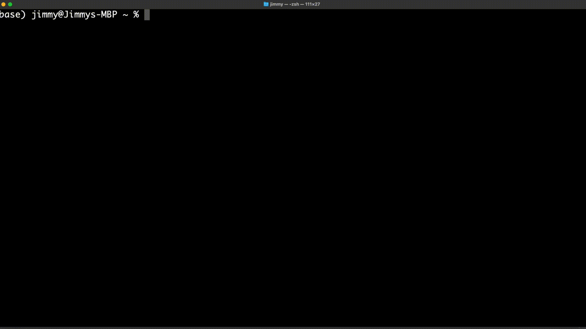

[](https://scrutinizer-ci.com/g/hermgerm29/qdbg-go/build-status/main)
[](https://scrutinizer-ci.com/g/hermgerm29/qdbg-go/?branch=main)


# qdbg-go
Quick debug tool - a general purpose CLI debugging utility. This is a GoLang implementation of [qdbg](https://github.com/hermgerm29/qdbg).

## Introduction



Eliminate the wasted clicks and keystrokes involved with copying your error messages into a search bar. `qdbg-go` does this tedious task for you (and we know you do it a lot :wink:). Simply run any command, and when your program inevitably fails, `qdbg-go` will automatically open a search tab for you.

```bash
qdbg-go <cmd>
```

In the unlikely event that your program runs successfully, `qdbg-go` will stay out of your way.


## Requirements

* A developer that runs faulty programs
* GoLang >= 1.18
* Linux or OSX operating system
* A functioning web browser

## Installation

### OSX / Linux

```bash
GOBIN=/usr/local/bin/ go install github.com/hermgerm29/qdbg-go@v0.1.0
```

### Windows

Not supported.
